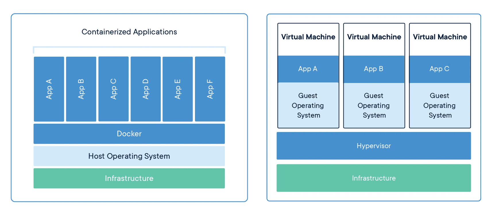

# Docker 与 CI/CD

分享主题

规划

1. Docker 概念基础
   1. 介绍
   2. 原理
2. Docker 入门
   1. 常用命令
   2. 构建镜像
      1. Dockerfile 指令
      2. nodejs
      3. nginx
      4. mysql
   3. 多阶段构建
   4. 容器编排 docker-compose
3. CI/CD 介绍
   1. 介绍
   2. CI 持续集成
   3. CD 持续交付/部署
4. 前端的 CI/CD 实现
   1. jenkins 流水线
   2. github actions
   3. gitlab runner

目录

- [Docker 与 CI/CD](#docker-与-cicd)
  - [Docker 概念基础](#docker-概念基础)
    - [什么是 Docker](#什么是-docker)
    - [为什么要用 Docker](#为什么要用-docker)
    - [Docker 是怎么实现的](#docker-是怎么实现的)
  - [Docker 入门](#docker-入门)
    - [入门学习](#入门学习)
    - [hello-nginx](#hello-nginx)
    - [Dockerfile 构建镜像](#dockerfile-构建镜像)
    - [Docker 缓存](#docker-缓存)
    - [多阶段构建](#多阶段构建)
  - [常见问题](#常见问题)
    - [为什么 Dockerfile 有的时候需要加 `ln -s /sbin/runc /usr/bin/runc`](#为什么-dockerfile-有的时候需要加-ln--s-sbinrunc-usrbinrunc)

## Docker 概念基础

### 什么是 Docker

Docker是一种轻量级的虚拟化技术，同时是一个开源的应用容器运行环境搭建平台。

> 容器是一种标准软件单元，它打包代码及其所有依赖项，以便应用程序从一个计算环境快速可靠地运行到另一个计算环境。
>
> Docker 容器映像是一个轻量级、独立的可执行软件包，其中包括运行应用程序所需的一切：代码、运行时、系统工具、系统库和设置。

Docker vs 传统虚拟化



### 为什么要用 Docker

- 更高效的利用系统资源
- 更快速的启动时间
- 一致的运行环境
- 持续交付和部署
- 更轻松的迁移
- 更轻松的维护和扩展

对比传统虚拟机总结

特性 | 容器 | 虚拟机
--- | ---- | ----
启动 | 秒级 | 分钟级
硬盘使用 | 一般为 MB | 一般为 GB
性能 | 接近原生 | 弱于
系统支持量 | 单机支持上千个容器 | 一般几十个

### Docker 是怎么实现的

我们写 js、css 遇到命名冲突，常使用命名空间来隔离作用域。

Docker 在一个操作系统上实现多个独立的容器也是这种思路。

> Docker 使用 Google 公司推出的 Go 语言 进行开发实现，基于 Linux 内核的 cgroup，namespace，以及 OverlayFS 类的 Union FS 等技术，对进程进行封装隔离，属于 操作系统层面的虚拟化技术。由于隔离的进程独立于宿主和其它的隔离的进程，因此也称其为容器。

Docker 架构


> runc 是一个 Linux 命令行工具，用于根据 OCI容器运行时规范 创建和运行容器。
>
> containerd 是一个守护程序，它管理容器生命周期，提供了在一个节点上执行容器和管理镜像的最小功能集。

linux 操作系统提供了 namespace 机制，可以给进程、用户、网络等分配一个命名空间，这个命名空间下的资源都是独立命名的。

- linux namespace
  - PID namespace: 进程 id 的命名空间
  - IPC namespace: 进程通信的命名空间
  - Mount namespace: 文件系统挂载的命名空间
  - Network namespace: 网络的命名空间
  - User namespace: 用户和用户组的命名空间
  - UTS namespace: 主机名和域名的命名空间
- 限制容器资源访问
  - Control Groups 指定资源的限制
  - 如：cpu 用多少、内存用多少、磁盘用多少
- 容器镜像与分层
  - UnionFS 联合文件系统
  - Dockerfile 指令
  - 镜像层
  - 缓存层
  - 查看创建镜像层的命令 `docker history hello:1`


## Docker 入门

Docker 使用客户端-服务器架构。

Docker 客户端与 Docker 守护程序通信，后者负责构建、运行和分发 Docker 容器的繁重工作。Docker 客户端和守护程序可以在同一系统上运行，也可以将 Docker 客户端连接到远程 Docker 守护程序。

Docker architecture


大家本机学习，可以从官网下载安装 Docker desktop 来使用 Docker。

更多内容，参考[官网文档](https://docs.docker.com/)

### 入门学习

我们构建以下几个常用容器

1. 基础镜像构建
   1. hello-nginx
   2. hello-nodejs
   3. hello-mysql
2. 多阶段构建
   1. Dockerfile 构建镜像
3. 容器编排 docker-compose

### hello-nginx

```bash
# 命令行
docker run \
  --name hello-nginx \
  -p 80:80 \
  -v ~/docker/hello-nginx:/usr/share/nginx/html \
  -e KEY1=VALUE1 \
  -d \
  nginx:latest
```

参数含义

- `-p` 是端口映射
- `-v` 是指定数据卷挂载目录
- `-e` 是指定环境变量
- `-d` 是后台运行
- `-i` 是 terminal 交互的方式运行
- `-t` 是 tty 终端类型

### Dockerfile 构建镜像

```bash
FROM node:latest

ARG RUNTIME_ENV

WORKDIR /app

COPY . .

RUN npm config set registry https://registry.npmmirror.com/

RUN npm install -g http-server

ENV RUNTIME_ENV=${RUNTIME_ENV}

EXPOSE 8080

CMD ["http-server", "-p", "8080"]
```

Dockerfile 指令含义

- `FROM`: 基于一个基础镜像来修改
- `WORKDIR`: 指定当前工作目录
- `COPY`: 把容器外的内容复制到容器内
- `EXPOSE`: 指定要暴露的端口，声明当前容器要访问的网络端口，比如这里起服务会用到 8080
- `RUN`: 在容器内执行命令
- `CMD`: 容器启动的时候执行的命令
- `ARG`: 声明构建参数，使用 `${xxx}` 来取
- `ENV`: 声明环境变量

Dockerfile 中不建议放置复杂的逻辑，而且它语法支持也很有限。如果有复杂的构建需求，更应该通过 Shell 脚本或者 Node 程序来实现。

差异

- `COPY` vs `ADD`
  - 把宿主机的文件复制到容器内
  - `ADD` 会把 `tar.gz` 解压然后复制到容器内
  - `COPY` 没有解压，复制到容器内
  - 推荐使用 `COPY`，因为该之类语义明确
- `CMD` vs `ENTRYPOINT`
  - 用 `CMD` 的时候，启动命令是可以重写的，将 Dockerfile 中 `CMD` 命令重写
  - 使用 `ENTRYPOINT` 不能重新启动命令
- `ARG` vs `ENV`
  - 都是设置环境变量
  - `ARG` 所设置是构建时的环境变量，在将来容器运行时是不会存在这些环境变量的。
  - 不要在 `ARG` 放置敏感信息，因为 `docker history` 可以看到构建的过程

```bash
# CMD
CMD ["sleep", "10m"]

# 构建镜像
docker build -t hello:first -f first.dockerfile .

# 运行容器（重新命令）
docker run -td --name hello-1 -p 5173:5173 hello:first npm run dev -- --host 0.0.0.0
```

构建命令格式

```bash
# 这个 . 就是构建上下文的目录，你也可以指定别的路径。
# 第一步 docker build 是将上下文目录（和子目录）发送到 docker 守护进程
# 内部的 COPY 等就是相对于这个目录路径
# COPY . . 相当于 COPY context/. .

docker build -t name:tag -f filename .

docker build -t demo:test1 .
docker build -t nest:first -f Dockerfile2 .
```

可以使用 `.dockerignore` 忽略文件

> `.DS_Store` 是 mac 的用于指定目录的图标、背景、字体大小的配置文件

### Docker 缓存

一旦层发生变化，所有下游层也需要重建。

```dockerfile
# syntax=docker/dockerfile:1
FROM node
WORKDIR /app
COPY . .          # Copy over all files in the current directory
RUN npm install   # Install dependencies
RUN npm build     # Run build
```

这个 Dockerfile 效率相当低。每次构建 Docker 映像时，更新任何文件都会导致重新安装所有依赖项，即使依赖项自上次以来没有更改！

该 `COPY` 命令可以分为两部分。首先，复制包管理文件（在本例中为package.json和yarn.lock）。然后，安装依赖项。最后，复制项目源代码，该源代码会经常更改。

```dockerfile
# syntax=docker/dockerfile:1
FROM node
WORKDIR /app
COPY package.json yarn.lock .    # Copy package management files
RUN npm install                  # Install dependencies
COPY . .                         # Copy over project files
RUN npm build                    # Run build
```

你可以使用 `.dockerignore` 文件指定过滤文件。

### 多阶段构建

```bash
# build stage
# FROM node:18 as build-stage
FROM node:18.0-alpine3.14 as build-stage

WORKDIR /app

COPY package.json .

RUN npm config set registry https://registry.npmmirror.com/

RUN npm install

COPY . .

RUN npm run build

# production stage
FROM node:18 as production-stage

COPY --from=build-stage /app/dist /app
COPY --from=build-stage /app/package.json /app/package.json

WORKDIR /app

RUN npm install --production

EXPOSE 3000

CMD ["node", "/app/main.js"]
```

## 常见问题


构建报错

```bash
ERROR: failed to solve: failed to compute cache key: failed to read expected number of bytes: unexpected EOF
```

拉取镜像时报错

```bash
docker pull node:20-alpine

Unable to pull node:latest

failed to read expected number of bytes: unexpected EOF
```

原因分析

可能的原因如下：

- 基础镜像所在仓库与构建集群间的网络不佳，例如跨境。
- 触发了仓库的限流机制，例如 Dockerhub 限制镜像拉取数量。

解决方案

建议将您的基础镜像存储至火山引擎镜像仓库 CR，在 Dockerfile 中从镜像仓库 CR 下载基础镜像。

```bash
# 查看配置
cat ~/.docker/daemon.json

# 确认网络连接
ping hub.docker.com

# 清除缓存
docker system prune -a --volumes
# 清理掉所有无用的镜像、容器和卷（注意备份需要的镜像和容器）
```

问题 2

pnpm 安装有 node_modules 时，构建镜像未按预期执行。

当项目安装过依赖时，需要添加 .dockerignore 文件，如 node_modules 文件夹。

不然构建镜像，`COPY . .` 等导致镜像运行不正常。

注意，可能会忽略 COPY 命令所需要的文件，如设置忽略 dist 目录，那么 nginx 镜像示例中 `COPY dist .` 会无效。

查看端口占用

```bash
# 端口使用情况
netstat -ntulp | grep 5173

# 查看端口占用
lsof -i:端口号

# Mac 下查看占用端口的进程
lsof -i tcp:5173

# 杀进程
kill -9 PID
```

### 为什么 Dockerfile 有的时候需要加 `ln -s /sbin/runc /usr/bin/runc`

在 Dockerfile 中使用  `ln -s /sbin/runc /usr/bin/runc` 的原因是为了解决某些 Linux 发行版中 runc 的路径问题。

runc 是一个用于运行容器的工具，它是 Docker 的一个子项目，也是 OCI（Open Container Initiative）的一个标准。在某些 Linux 发行版中，runc 的路径可能不是 `/usr/bin/runc`，而是 `/sbin/runc` 或其他路径。这会导致在构建 Dockeer 镜像时无法找到 runc，从而导致构建失败。为了解决这个问题，可以在 Dockerfile 中使用 `ln -s /sbin/runc /usr/bin/runc` 命令，将 `/sbin/runc` 软链接到 `/usr/bin/runc`，这样就可以在构建镜像时找到 runc。

需要注意的是，这个问题只是出现在某些 Linux 发行版中，如果你的 Linux 发行版中 runc 的路径是 `/usr/bin/runc`，那么就不需要在 Dockerfile 中使用 `ln -s /sbin/runc /usr/bin/runc` 命令。

参考：

- https://www.volcengine.com/docs/6461/191606
- https://www.volcengine.com/docs/6461/163867
