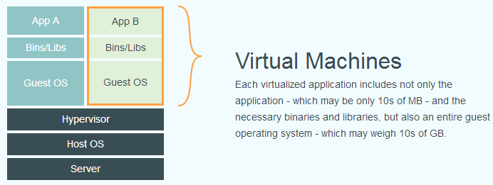

# docker 与 CI/CD

分享主题

1. Docker 概念基础
   1. 介绍
   2. 原理
2. Docker 入门
   1. 常用命令
   2. 构建镜像
   3. 前端构建镜像
3. CI/CD 介绍
   1. 介绍
   2. CI 持续集成
   3. CD 持续交付/部署
4. 前端的 CI/CD 实现
   1. jenkins 流水线
   2. github actions
   3. gitlab runner

## Docker 概念基础

### 什么是 Docker

Docker是一种轻量级的虚拟化技术，同时是一个开源的应用容器运行环境搭建平台

> 容器是一种标准软件单元，它打包代码及其所有依赖项，以便应用程序从一个计算环境快速可靠地运行到另一个计算环境。Docker 容器映像是一个轻量级、独立的可执行软件包，其中包括运行应用程序所需的一切：代码、运行时、系统工具、系统库和设置。
>
> Docker 使用 Google 公司推出的 Go 语言 进行开发实现，基于 Linux 内核的 cgroup，namespace，以及 OverlayFS 类的 Union FS 等技术，对进程进行封装隔离，属于 操作系统层面的虚拟化技术。

Docker 架构


Docker vs VM(virtual Machines)

传统虚拟化



Docker


### 为什么要用 Docker

- 更高效的利用系统资源
- 更快速的启动时间
- 一致的运行环境
- 持续交付和部署
- 更轻松的迁移
- 更轻松的维护和扩展

对比传统虚拟机总结

特性 | 容器 | 虚拟机
--- | ---- | ----
启动 | 秒级 | 分钟级
硬盘使用 | 一般为 MB | 一般为 GB
性能 | 接近原生 | 弱于
系统支持量 | 单机支持上千个容器 | 一般几十个

## Docker 入门

Docker 使用客户端-服务器架构。

Docker 客户端与 Docker 守护程序通信，后者负责构建、运行和分发 Docker 容器的繁重工作。Docker 客户端和守护程序可以在同一系统上运行，也可以将 Docker 客户端连接到远程 Docker 守护程序。

Docker architecture


大家本机学习，可以从官网下载 Docker desktop 安装来使用 Docker。

更多内容，参考[官网文档](https://docs.docker.com/)

### 入门学习

我们构建以下几个常用容器

1. 基础镜像构建
   1. hello-nginx
   2. hello-nodejs
   3. hello-mysql
2. 多阶段构建
   1. Dockerfile 构建镜像
3. 容器编排 docker-compose

### hello-nginx

```bash
# 命令行
docker run \
  --name hello-nginx \
  -p 80:80 \
  -v /tmp/docker/hello-nginx:/usr/share/nginx/html \
  -e KEY1=VALUE1 \
  -d \
  nginx:latest
```

参数含义

- `-p` 是端口映射
- `-v` 是指定数据卷挂载目录
- `-e` 是指定环境变量
- `-d` 是后台运行
- `-i` 是 terminal 交互的方式运行
- `-t` 是 tty 终端类型

### Dockerfile 构建镜像

```bash
FROM node:latest

ARG RUNTIME_ENV

WORKDIR /app

COPY . .

RUN npm config set registry https://registry.npmmirror.com/

RUN npm install -g http-server

ENV RUNTIME_ENV=${RUNTIME_ENV}

EXPOSE 8080

CMD ["http-server", "-p", "8080"]
```

指令含义

- `FROM`: 基于一个基础镜像来修改
- `WORKDIR`: 指定当前工作目录
- `COPY`: 把容器外的内容复制到容器内
- `EXPOSE`: 指定要暴露的端口，声明当前容器要访问的网络端口，比如这里起服务会用到 8080
- `RUN`: 在容器内执行命令
- `CMD`: 容器启动的时候执行的命令
- `ARG`: 声明构建参数，使用 `${xxx}` 来取
- `ENV`: 声明环境变量

差异

- `COPY` vs `ADD`
  - 把宿主机的文件复制到容器内
  - `ADD` 会把 `tar.gz` 解压然后复制到容器内
  - `COPY` 没有解压，复制到容器内
- `CMD` vs `ENTRYPOINT`
  - 用 `CMD` 的时候，启动命令是可以重写的，将 Dockerfile 中 `CMD` 命令重写
  - 使用 `ENTRYPOINT` 不能重新启动命令

```bash
# CMD

# 构建镜像
docker build -t hello:first -f first.dockerfile .

# 运行容器（重新命令）
docker run -td --name hello-1 -p 5173:5173 hello:first npm run dev -- --host 0.0.0.0
```

构建命令格式

```bash
# 这个 . 就是构建上下文的目录，你也可以指定别的路径。
docker build -t name:tag -f filename .

docker build -t demo:test1 .
docker build -t nest:first -f Dockerfile2 .
```

可以使用 `.dockerignore` 忽略文件

> `.DS_Store` 是 mac 的用于指定目录的图标、背景、字体大小的配置文件

### 多阶段构建

```bash
# build stage
# FROM node:18 as build-stage
FROM node:18.0-alpine3.14 as build-stage

WORKDIR /app

COPY package.json .

RUN npm config set registry https://registry.npmmirror.com/

RUN npm install

COPY . .

RUN npm run build

# production stage
FROM node:18 as production-stage

COPY --from=build-stage /app/dist /app
COPY --from=build-stage /app/package.json /app/package.json

WORKDIR /app

RUN npm install --production

EXPOSE 3000

CMD ["node", "/app/main.js"]
```

### 为什么 Dockerfile 有的时候需要加 `ln -s /sbin/runc /usr/bin/runc`

在 Dockerfile 中使用  `ln -s /sbin/runc /usr/bin/runc` 的原因是为了解决某些 Linux 发行版中 runc 的路径问题。

runc 是一个用于运行容器的工具，它是 Docker 的一个子项目，也是 OCI（Open Container Initiative）的一个标准。在某些 Linux 发行版中，runc 的路径可能不是 `/usr/bin/runc`，而是 `/sbin/runc` 或其他路径。这会导致在构建 Dockeer 镜像时无法找到 runc，从而导致构建失败。为了解决这个问题，可以在 Dockerfile 中使用 `ln -s /sbin/runc /usr/bin/runc` 命令，将 `/sbin/runc` 软链接到 `/usr/bin/runc`，这样就可以在构建镜像时找到 runc。

需要注意的是，这个问题只是出现在某些 Linux 发行版中，如果你的 Linux 发行版中 runc 的路径是 `/usr/bin/runc`，那么就不需要在 Dockerfile 中使用 `ln -s /sbin/runc /usr/bin/runc` 命令。
