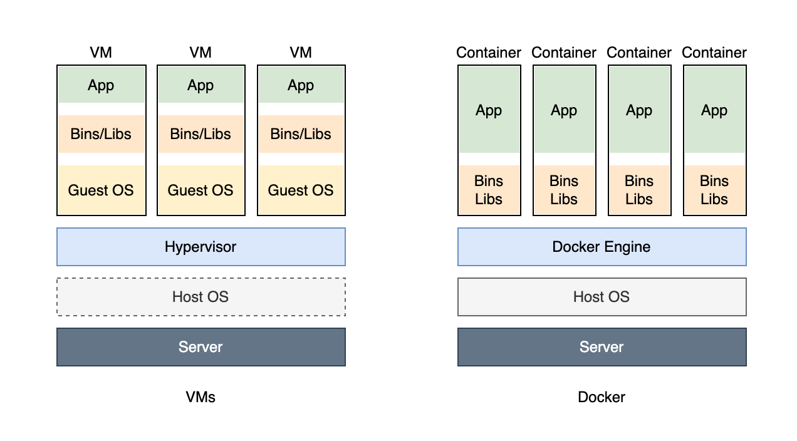

# Docker 与 CI/CD

分享主题

规划

- [Docker 与 CI/CD](#docker-与-cicd)
  - [Docker 概念基础](#docker-概念基础)
    - [什么是 Docker](#什么是-docker)
    - [为什么要用 Docker](#为什么要用-docker)
    - [Docker 是怎么实现的](#docker-是怎么实现的)
  - [Docker 入门](#docker-入门)
    - [入门学习](#入门学习)
    - [常用命令](#常用命令)
    - [基础镜像](#基础镜像)
    - [Dockerfile 构建镜像](#dockerfile-构建镜像)
    - [扩展知识](#扩展知识)
      - [Docker 缓存](#docker-缓存)
    - [多阶段构建](#多阶段构建)
    - [容器编排](#容器编排)
  - [CI/CD](#cicd)
    - [持续集成](#持续集成)
    - [CD 持续交付/持续部署](#cd-持续交付持续部署)

## Docker 概念基础

### 什么是 Docker

Docker是一种轻量级的虚拟化技术，同时是一个开源的应用容器运行环境搭建平台。

> 容器是一种标准软件单元，它打包代码及其所有依赖项，以便应用程序从一个计算环境快速可靠地运行到另一个计算环境。
>
> Docker 容器映像是一个轻量级、独立的可执行软件包，其中包括运行应用程序所需的一切：代码、运行时、系统工具、系统库和设置。

Docker vs 传统虚拟化



### 为什么要用 Docker

- 更高效的利用系统资源
- 更快速的启动时间
- 一致的运行环境
- 持续交付和部署
- 更轻松的迁移
- 更轻松的维护和扩展

对比传统虚拟机总结

特性 | 容器 | 虚拟机
--- | ---- | ----
启动 | 秒级 | 分钟级
硬盘使用 | 一般为 MB | 一般为 GB
性能 | 接近原生 | 弱于
系统支持量 | 单机支持上千个容器 | 一般几十个

### Docker 是怎么实现的

我们写 js、css 遇到命名冲突，常使用命名空间来隔离作用域。

Docker 在一个操作系统上实现多个独立的容器也是这种思路。

> Docker 使用 Google 公司推出的 Go 语言 进行开发实现，基于 Linux 内核的 cgroup，namespace，以及 OverlayFS 类的 Union FS 等技术，对进程进行封装隔离，属于 操作系统层面的虚拟化技术。由于隔离的进程独立于宿主和其它的隔离的进程，因此也称其为容器。

Docker 的实现


> runc 是一个 Linux 命令行工具，用于根据 OCI容器运行时规范 创建和运行容器。
>
> containerd 是一个守护程序，它管理容器生命周期，提供了在一个节点上执行容器和管理镜像的最小功能集。

linux 操作系统提供了 namespace 机制，可以给进程、用户、网络等分配一个命名空间，这个命名空间下的资源都是独立命名的。

- linux namespace
  - PID namespace: 进程 id 的命名空间
  - IPC namespace: 进程通信的命名空间
  - Mount namespace: 文件系统挂载的命名空间
  - Network namespace: 网络的命名空间
  - User namespace: 用户和用户组的命名空间
  - UTS namespace: 主机名和域名的命名空间
- 限制容器资源访问
  - Control Groups 指定资源的限制
  - 如：cpu 用多少、内存用多少、磁盘用多少
- 容器镜像与分层
  - UnionFS 联合文件系统
  - Dockerfile 指令
  - 镜像层
  - 缓存层
  - 查看创建镜像层的命令 `docker history hello:1`


## Docker 入门

Docker 使用客户端-服务器架构。

Docker 客户端与 Docker 守护程序通信，后者负责构建、运行和分发 Docker 容器的繁重工作。Docker 客户端和守护程序可以在同一系统上运行，也可以将 Docker 客户端连接到远程 Docker 守护程序。

Docker architecture


大家本机学习，可以从官网下载安装 Docker desktop 来使用 Docker。

更多内容，参考[官网文档](https://docs.docker.com/)

### 入门学习

我们构建以下几个常用容器

1. 常用命令
2. 构建镜像
   1. hello-nginx
   2. hello-nodejs
   3. hello-mysql
3. 多阶段构建
   1. Dockerfile 构建镜像
4. docker-compose

### 常用命令

```bash
docker -h

docker pull
docker images
docker ps
docker image ls
docker container ls
docker build
docker run
docker exec
docker info
docker system df
docker system prune
```

### 基础镜像

hello-nginx

```bash
# 命令行
docker run \
  --name hello-nginx \
  -p 80:80 \
  -v ~/docker/hello-nginx:/usr/share/nginx/html \
  -e KEY1=VALUE1 \
  -d \
  nginx:latest
```

参数含义

- `-p` 是端口映射
- `-v` 是指定数据卷挂载目录
- `-e` 是指定环境变量
- `-d` 是后台运行
- `-i` 是 terminal 交互的方式运行
- `-t` 是 tty 终端类型

### Dockerfile 构建镜像

使用 Dockerfile 指令实现自定义镜像

```bash
# 新建一个项目
npm create vite@latest
# 选择 react

pnpm i
pnpm run build
```

第一个镜像 hello-1

```bash
docker run \
  --name hello-01 \
  -p 80:80 \
  -v ./dist:/usr/share/nginx/html \
  -d \
  nginx:latest

# Dockerfile
FROM nginx:alpine

COPY dist /usr/share/nginx/html
```

第二个镜像 hello-2

```bash
# FROM node:latest
FROM node:18-alpine

WORKDIR /app

COPY package.json pnpm-lock.yaml .

RUN npm config set registry https://registry.npmmirror.com/

RUN npm i -g pnpm serve
RUN pnpm install

COPY . .

RUN npm run build

EXPOSE 5173

CMD ["serve", "dist", "-l", "5173"]
```

Dockerfile 指令含义

- `FROM`: 基于一个基础镜像来修改
- `WORKDIR`: 指定当前工作目录
- `COPY`: 把容器外的内容复制到容器内
- `EXPOSE`: 指定要暴露的端口，声明当前容器要访问的网络端口，比如这里起服务会用到 8080
- `RUN`: 在容器内执行命令
- `CMD`: 容器启动的时候执行的命令
- `ARG`: 声明构建参数，使用 `${xxx}` 来取
- `ENV`: 声明环境变量

Dockerfile 中不建议放置复杂的逻辑，而且它语法支持也很有限。如果有复杂的构建需求，更应该通过 Shell 脚本或者 Node 程序来实现。

差异

- `COPY` vs `ADD`
  - 把宿主机的文件复制到容器内
  - `ADD` 会把 `tar.gz` 解压然后复制到容器内
  - `COPY` 没有解压，复制到容器内
  - 推荐使用 `COPY`，因为该之类语义明确
- `CMD` vs `ENTRYPOINT`
  - 用 `CMD` 的时候，启动命令是可以重写的，将 Dockerfile 中 `CMD` 命令重写
  - 使用 `ENTRYPOINT` 不能重新启动命令
- `ARG` vs `ENV`
  - 都是设置环境变量
  - `ARG` 所设置是构建时的环境变量，在将来容器运行时是不会存在这些环境变量的。
  - 不要在 `ARG` 放置敏感信息，因为 `docker history` 可以看到构建的过程

构建镜像

```bash
# 构建镜像
docker build -f config/1.dockerfile -t hello:1 .
```

注意事项

::: warning 上下文

这个 `.` 就是构建上下文的目录，你也可以指定别的路径。

`docker build` 第一步就是将上下文目录（和子目录）发送到 docker 守护进程

后续操作文件，就是基于这个上下文操作，端上脱离上下文的文件无法操作

如: `COPY . .` 相当于 `COPY context/. .`

:::


运行容器

```bash
# 运行容器
docker run -d --name hello-1 -p 8090:80 hello:1
docker run -d --name hello-3 -p 5174:5173 hello:3

# 重写命令
docker run -d --name hello-3 -p 5174:5173 hello:3 npm run dev -- --host 0.0.0.0
```


### 扩展知识

#### Docker 缓存

Docker 的构建如下

1. Docker 构建由一系列有序的构建指令组成（Dockerfile 指令）。
2. Docker 运行构建时，会将每一次指令构建缓存一层，构建器会尝试重用早期构建中的层。
3. Docker 镜像时多层存储的。

由此可以看出，Dockerfile 指令的顺序很重要，一旦某层发生变化，所有下游层也需要重建。

示例

```dockerfile
# syntax=docker/dockerfile:1
FROM node
WORKDIR /app
COPY . .          # Copy over all files in the current directory
RUN npm install   # Install dependencies
RUN npm build     # Run build
```

这个 Dockerfile 效率相当低。每次构建 Docker 映像时，更新任何文件都会导致重新安装所有依赖项，即使依赖项自上次以来没有更改！

该 `COPY` 命令可以分为两部分。首先，复制包管理文件（在本例中为package.json和yarn.lock）。然后，安装依赖项。最后，复制项目源代码，该源代码会经常更改。

```dockerfile
# syntax=docker/dockerfile:1
FROM node
WORKDIR /app
COPY package.json package-lock.json .   # Copy package management files
RUN npm install                         # Install dependencies
COPY . .                                # Copy over project files
RUN npm build                           # Run build
```

你可以使用 `.dockerignore` 文件指定过滤文件。

> `.DS_Store` 是 mac 的用于指定目录的图标、背景、字体大小的配置文件

更多缓存复用

- [pnpm+docker](https://pnpm.io/zh/docker)

接下来我们继续讲 Docker 构建高级用法

### 多阶段构建

适用多阶段构建主要有两个主要原因

1. 创建占用空间较小的最终映像
2. 并行运行生成步骤，使生成管道更快、更高效

```bash
# 多阶段构建
FROM node:18-alpine as builder

WORKDIR /app

COPY package.json pnpm-lock.yaml .

RUN npm config set registry https://registry.npmmirror.com/

RUN npm i -g pnpm serve
RUN pnpm install

COPY . .

RUN npm run build

FROM nginx:alpine
COPY --from=builder app/nginx.conf /etc/nginx/conf.d/default.conf
COPY --from=builder app/dist /usr/share/nginx/html
```

关于并行构建，可参考[官方示例](https://docs.docker.com/build/guide/multi-stage/)

下面虚拟一个例子

```bash
FROM node:18-alpine as base

WORKDIR /app

COPY package.json pnpm-lock.yaml .

RUN npm config set registry https://registry.npmmirror.com/

RUN npm i -g pnpm serve
RUN pnpm install

COPY . .

FROM base as lint
RUN npm run lint

FROM base as testing
RUN npm run build
RUN npm run test

FROM nginx:alpine
COPY --from=testing app/nginx.conf /etc/nginx/conf.d/default.conf
COPY --from=testing app/dist /usr/share/nginx/html
```

以上 lint 与 testing 流程就是并行的

前面介绍了使用一个 Dockerfile 文件，让我们很方便的定义一个单独的应用容器。

在日常工作中，经常会碰到需要多个容器相互配合来完成某项任务的情况。

比如 web应用和数据库

### 容器编排

Compose 项目是 Docker 官方的开源项目，负责实现对 Docker 容器集群的快速编排。

Compose 中有两个重要的概念：

- 服务 (service)：一个应用的容器，实际上可以包括若干运行相同镜像的容器实例。
- 项目 (project)：由一组关联的应用容器组成的一个完整业务单元，在 docker-compose.yml 文件中定义。

可见，一个项目可以由多个服务（容器）关联而成，Compose 面向项目进行管理。

场景

最常见的项目是 web 网站，该项目应该包含 web 应用和缓存。

```bash
# docker-compose.yml
version: '3'
services:
  web:
    build: .
    ports:
      - "5000:5000"
    depends_on:
      - redis
  redis:
    image: "redis:alpine"

```

真实示例

- wordpress
- yapi

组合使用

docker-compose 也支持与 Dockerfile 模板文件一起使用。

```bash
version: "3"
services:

  # docker-compose up -d --build web
  web:
    build:
      context: .
      dockerfile: config/5.dockerfile
    ports:
      - 4000:80
```

如果有更多的容器，数十上百甚至更多需要管理呢？

Docker Compose 是一种工具，可让您运行使用 Compose 文件格式定义的多容器 Docker 应用程序。使用 Compose 文件，您可以使用单个命令创建和启动配置中定义的所有服务。但它功能有限，最流行的容器编排工具是 Kubernetes，已成为行业标准。

Kubernetes 是一个开源的容器编排引擎，用来对容器化应用进行自动化部署、 扩缩和管理。

> Docker Compose 旨在在单个主机系统上运行容器。相比之下，Kubernetes 可以管理跨多个节点（计算机）部署的容器。

对于 k8s，想了解更多请参看 [Kubernetes 官方文档](https://kubernetes.io/zh-cn/docs/home/)

前面介绍了容器，接下来我们来介绍 CI/CD

## CI/CD

### 持续集成


### CD 持续交付/持续部署
